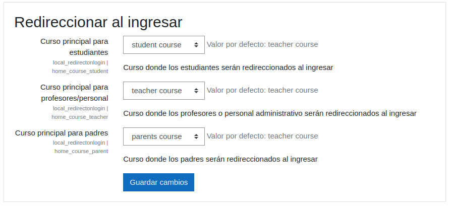

# Redirect on login

## Descripción
Plugin para redireccionar a los usuarios en base a su ingreso, tomando en cuenta ciertas condiciones.

Se tienen 3 tipos de usuarios:
* Padres: Si el usuario ingresa por método manual a la plataforma.
* Estudiantes: Si el usuario ingresa a través de Office365 y su dirección de correo posee el siguiente formato: `e123456789@escuela.pr`, donde `123456789` hace referencia al numero de identificacion del usuario, y `escuela` es el dominio de la escuela a la cual pertenece.

* Docentes y personal administrativo: Estos usuarios pueden ingresar por varias condiciones:
    * Ingresa a través de Office365 y su dirección de correo posee el siguiente formato: `direccion@itec.pr` 
    * Ingresa a través de Office365 y su dirección de correo posee el siguiente formato: `direccion@de.pr.gov` 
    * Ingresa a través de Office365 y su dirección de correo posee el siguiente formato: `de123456789@escuela.pr`, donde `123456789` hace referencia al numero de identificacion del usuario, y `escuela` es el dominio de la escuela a la cual pertenece.

## Configuración

Se deben seleccionar los cursos a los cuales los usuarios serán redireccionados en base a las condiciones antes mencionadas.

